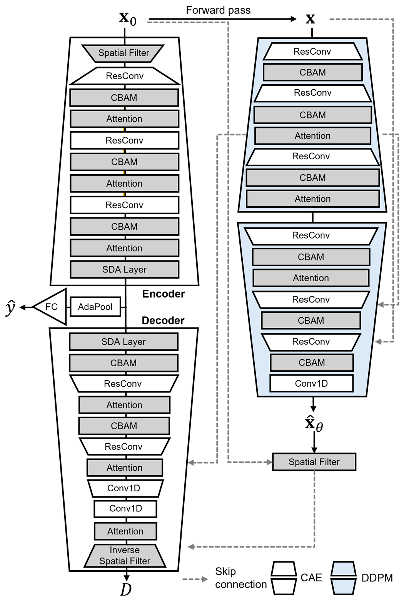
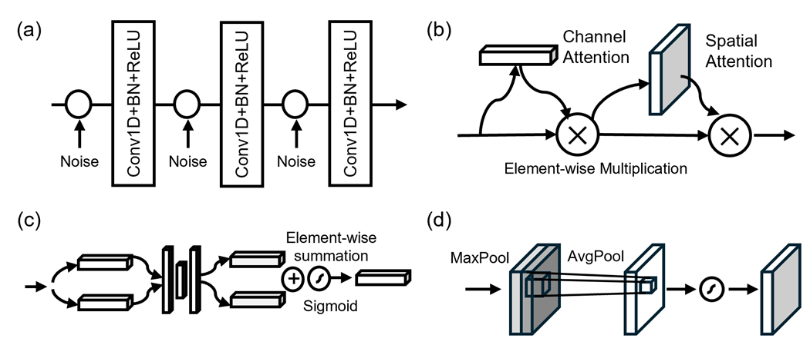

# DiffSA-EEG: A Diffusion-Based Framework for Abnormal EEG Classification with Integrated Spatial Filtering and Attention Mechanisms

[](https://www.python.org/downloads/)
[](https://pytorch.org/)
[](LICENSE)

This repository contains the official implementation of **DiffSA-EEG**, a diffusion-based EEG classification framework that integrates spatial filtering, denoising, and attention mechanisms within an end-to-end discriminative pipeline for robust detection of brain signal abnormalities in clinical EEG recordings.

DiffSA-EEG extends the [Diff-E](https://github.com/diffe2023/Diff-E) framework (Interspeech 2023) with four key components: learnable spatial filters (SF), stacked denoising autoencoders (SDA), self-attention blocks, and convolutional block attention modules (CBAM).

> **Paper**: *DiffSA-EEG: A Diffusion-Based Framework for Abnormal EEG Classification with Integrated Spatial Filtering and Attention Mechanisms*
> Jae-Pil Lee, Jin-Young Chung, Wiha Choi, Jaeho Jang, Hyang-Sook Hoe, Hyun-Chul Kim*

---

## Overview

Automated interpretation of clinical EEG is challenging due to heterogeneous signal characteristics, noise contamination, and inter-subject variability. DiffSA-EEG addresses these challenges by integrating diffusion modeling directly into a discriminative classification pipeline, rather than using it solely for data generation or augmentation.

**Key contributions:**
- Integrates a DDPM as a **trajectory-based feature regularizer** that stabilizes learning and enhances robustness under noisy clinical conditions
- Introduces a **learnable spatial filter** (SF) based on SVD decomposition to reduce channel dimensionality and enhance topographical discriminability
- Combines **stacked denoising autoencoders** (SDA) with **attention mechanisms** (self-attention + CBAM) for noise-invariant feature learning
- Demonstrates that **optimal component combinations are dataset-dependent**: SF+SDA for TUAB, SDA+CBAM for TUEP
- Achieves state-of-the-art performance on both TUAB and TUEP clinical EEG benchmarks

## Architecture

<p align="center">
  
</p>

The framework consists of three jointly optimized components:
1. **DDPM (Conditional U-Net)**: Models the complex distribution of EEG signals and provides diffusion-based feature regularization via skip connections to the CAE decoder
2. **CAE (Conditional Autoencoder)**: Encoder-decoder architecture with SF, SDA, attention, and CBAM components that corrects diffusion reconstruction errors
3. **Classification Head**: Adaptive average pooling followed by a fully connected layer that produces predictions from the shared latent representation

**Joint loss**: `L_total = L_DDPM + L_CAE + L_CLS`

### Component Details

<p align="center">
  
</p>

**(a)** ResConv block with noise injection, **(b)** CBAM (Channel + Spatial Attention), **(c)** SDA Layer with element-wise summation and sigmoid gating, **(d)** Attention module with MaxPool and AvgPool.

## Results

### TUAB Dataset (Normal vs. Abnormal EEG)

| Model | Accuracy (%) | Recall (%) | Specificity (%) | AUC-ROC (%) | AUC-PR (%) | Balanced Acc. (%) |
|:------|:---:|:---:|:---:|:---:|:---:|:---:|
| EEGNet | 78.0 +/- 0.4 | 77.7 +/- 0.4 | 74.4 +/- 1.4 | 83.3 +/- 0.3 | 55.0 +/- 5.0 | 46.8 +/- 5.0 |
| Deep4Net | 82.5 +/- 0.6 | 82.0 +/- 0.5 | 76.0 +/- 1.1 | 89.5 +/- 0.4 | 90.0 +/- 0.4 | 81.9 +/- 0.5 |
| ChronoNet | 81.7 +/- 0.7 | 81.2 +/- 0.7 | 75.0 +/- 0.8 | 87.8 +/- 0.8 | 88.4 +/- 0.8 | 81.2 +/- 0.8 |
| TCN | 79.9 +/- 0.1 | 79.3 +/- 0.2 | 72.1 +/- 1.1 | 84.7 +/- 0.2 | 84.7 +/- 0.1 | 79.3 +/- 0.2 |
| Diff-E | 82.6 +/- 0.1 | 81.8 +/- 0.1 | 72.1 +/- 0.8 | 88.2 +/- 0.1 | 87.6 +/- 0.2 | 76.9 +/- 0.5 |
| **DiffSA-EEG** | **83.9 +/- 0.3** | **83.6 +/- 0.3** | **79.4 +/- 0.8** | **90.6 +/- 0.3** | **89.4 +/- 0.5** | **81.5 +/- 0.6** |

### TUEP Dataset (Epilepsy vs. Non-epilepsy)

| Model | Accuracy (%) | Recall (%) | Specificity (%) | AUC-ROC (%) | AUC-PR (%) | Balanced Acc. (%) |
|:------|:---:|:---:|:---:|:---:|:---:|:---:|
| EEGNet | 58.1 +/- 1.8 | 58.3 +/- 1.8 | 17.6 +/- 3.8 | 90.0 +/- 1.1 | 54.5 +/- 2.9 | 46.8 +/- 5.0 |
| Deep4Net | 85.2 +/- 1.1 | 85.3 +/- 1.1 | 71.2 +/- 2.3 | 96.7 +/- 0.3 | 94.7 +/- 0.9 | 81.9 +/- 0.5 |
| ChronoNet | 90.4 +/- 0.3 | 90.4 +/- 0.3 | 88.2 +/- 1.1 | 96.5 +/- 0.2 | 96.0 +/- 0.3 | 81.2 +/- 0.8 |
| TCN | 91.6 +/- 0.1 | 91.6 +/- 0.1 | 87.9 +/- 0.4 | 96.5 +/- 0.1 | 93.8 +/- 0.3 | 79.3 +/- 0.2 |
| Diff-E | 94.6 +/- 0.1 | 94.6 +/- 0.1 | 92.0 +/- 0.5 | 98.1 +/- 0.1 | 97.6 +/- 0.1 | 93.3 +/- 0.3 |
| **DiffSA-EEG** | **94.7 +/- 0.2** | **94.7 +/- 0.2** | **93.2 +/- 0.2** | **98.3 +/- 0.1** | **97.8 +/- 0.3** | **94.0 +/- 0.2** |

### Ablation Study (Best Two-Component Configurations)

| Dataset | Best Configuration | Accuracy (%) | AUC-ROC (%) | Balanced Acc. (%) |
|:--------|:-------------------|:---:|:---:|:---:|
| TUAB | SF + SDA | 84.6 +/- 0.1 | 90.8 +/- 0.2 | 81.6 +/- 0.6 |
| TUEP | SDA + CBAM | 96.0 +/- 0.2 | 98.4 +/- 0.2 | 95.1 +/- 0.2 |

All results are reported as mean +/- standard error over 10 independent runs. Statistical significance was assessed via bootstrap-based two-sample t-tests (p < 0.05).

> **Note**: The `sample_data/` included in this repository is provided solely for verifying that the code runs without errors. To reproduce the reported results, please use the complete TUAB and TUEP datasets as described in the [Data Preparation](#data-preparation) section.

## Installation

### Prerequisites

- Linux (tested on Ubuntu 20.04 LTS)
- NVIDIA GPU with CUDA support (tested on RTX A6000, 48 GB)
- Conda package manager

### Setup

```bash
# Clone the repository
git clone https://github.com/Lee-jaepil/DiffSA-EEG.git
cd DiffSA-EEG

# Create conda environment
conda create -n diffsa-eeg python=3.8 -y
conda activate diffsa-eeg

# Install PyTorch with CUDA support
pip install torch torchvision torchaudio --index-url https://download.pytorch.org/whl/cu121

# Install dependencies
pip install -r requirements.txt
```

### Dependencies

| Package | Purpose |
|---------|---------|
| `torch` | Deep learning framework |
| `einops` | Tensor operations |
| `ema_pytorch` | Exponential moving average for classifier |
| `numpy` | Numerical computing |
| `scikit-learn` | Metrics and evaluation |
| `mne` | EEG data processing |
| `tqdm` | Progress bars |
| `matplotlib` | Visualization |
| `scipy` | Signal processing |

## Data Preparation

### Datasets

DiffSA-EEG is evaluated on two publicly available clinical EEG datasets from the Temple University Hospital:

- **[TUAB](https://isip.piconepress.com/projects/tuh_eeg/html/downloads.shtml)** (v3.0.1): Temple University Hospital Abnormal EEG Corpus -- 2,993 recordings (1,521 normal, 1,472 abnormal) from 2,130 patients
- **[TUEP](https://isip.piconepress.com/projects/tuh_eeg/html/downloads.shtml)** (v2.0.1): Temple University Epilepsy Corpus -- 2,298 recordings (513 non-epileptic, 1,785 epileptic) from 200 patients

### Preprocessing

1. Select 21 EEG channels using the standard international 10-20 system: Fp1, Fp2, F3, F4, C3, C4, P3, P4, O1, O2, F7, F8, T3(T7), T4(T8), T5(P7), T6(P8), Fz, Cz, Pz, A1, A2
2. Downsample to 250 Hz
3. Apply a 1 Hz high-pass Butterworth filter and a 60 Hz notch filter
4. Segment the first 60 seconds of each recording and generate an additional segment via time reversal augmentation
5. Extract two non-overlapping 60-second segments per recording
6. Normalize each segment using z-scoring

### Data Directory Structure

After preprocessing, organize the data as follows:

```
Preprocessed_Data/
├── TUAB/                          # or TUEP
│   ├── Group_1/
│   │   └── group_1.npz            # NPZ with 'data', 'labels', 'file_paths'
│   ├── Group_2/
│   │   └── group_2.npz
│   └── ...
├── TUAB_Evaluation/
│   └── evaluation_dataset.npz
└── TUEP/
    ├── Fold_1/
    │   └── fold_1_data.npz        # For 5-fold cross-validation
    ├── Fold_2/
    │   └── fold_2_data.npz
    └── ...
```

Each `.npz` file contains:
- `data`: EEG segments of shape `(N, channels, time_samples)` -- 21 channels, 250 time points
- `labels`: Binary labels (0/1)
- `file_paths`: Source recording identifiers

## Training

### DiffSA-EEG (Full Model)

```bash
# Train on TUAB dataset
python main.py \
    --device cuda:0 \
    --dataset TRA \
    --model SSDA_attn_SF_CBAM \
    --num_epochs 100 \
    --batch_size 4 \
    --alpha 0.1 \
    --num_classes 2 \
    --start_group 1 \
    --end_group 9

# Train on TUEP dataset
python main.py \
    --device cuda:0 \
    --dataset TUEP \
    --model SSDA_attn_SF_CBAM \
    --num_epochs 100 \
    --batch_size 8 \
    --start_group 1 \
    --end_group 9
```

### Baseline Models

```bash
# EEGNet
python main.py --device cuda:0 --model EEGNet --dataset TRA --num_epochs 100 --batch_size 8

# Deep4Net
python main.py --device cuda:0 --model Deep4Net --dataset TRA --num_epochs 100 --batch_size 8

# ChronoNet
python main.py --device cuda:0 --model ChronoNet --dataset TRA --num_epochs 100 --batch_size 8

# TCN (BDTCN)
python main.py --device cuda:0 --model BDTCN --dataset TRA --num_epochs 100 --batch_size 8
```

### Key Arguments

| Argument | Default | Description |
|----------|---------|-------------|
| `--device` | `cuda:0` | GPU device |
| `--dataset` | `TRA` | Dataset name (RAW, TRA, TRAx3, TCP, TCPx3, TUEP, TUSZ, TUEP_NoSMOTE) |
| `--model` | `SSDA_attn_SF_CBAM` | Model architecture (DiffE, SSDA_attn_SF_CBAM, EEGNet, ChronoNet, BDTCN, Deep4Net) |
| `--num_epochs` | `100` | Number of training epochs |
| `--batch_size` | `4` | Batch size |
| `--alpha` | `0.1` | Weight for diffusion loss in combined objective |
| `--num_classes` | `2` | Number of output classes |
| `--start_group` | `1` | Start data group index |
| `--end_group` | `9` | End data group index |

## Ablation Study

The ablation study evaluates all 16 combinations of the four components (SF, SDA, Attention, CBAM) added to the Diff-E backbone.

### Single Configuration

```bash
python ablation_study_TUEP_5fold.py \
    --num_runs 10 \
    --num_epochs 100 \
    --batch_size 32 \
    --device cuda:0 \
    --run_single_config \
    --config_name "SF+SSDA+Attn+CBAM"
```

### All 16 Configurations (Parallel across GPUs)

```bash
bash scripts/run_ablation_5fold_parallel.sh
```

This distributes the 16 configurations across 2 GPUs, running 10 independent runs with 5-fold cross-validation for each (total: 800 model training runs).

### Ablation Configurations

| # | Configuration | SF | SSDA | Attn | CBAM |
|---|---------------|:---:|:---:|:----:|:----:|
| 1 | None (Diff-E backbone) | | | | |
| 2 | SF | x | | | |
| 3 | SSDA | | x | | |
| 4 | Attn | | | x | |
| 5 | CBAM | | | | x |
| 6 | SF+SSDA | x | x | | |
| 7 | SF+Attn | x | | x | |
| 8 | SF+CBAM | x | | | x |
| 9 | SSDA+Attn | | x | x | |
| 10 | SSDA+CBAM | | x | | x |
| 11 | Attn+CBAM | | | x | x |
| 12 | SF+SSDA+Attn | x | x | x | |
| 13 | SF+SSDA+CBAM | x | x | | x |
| 14 | SF+Attn+CBAM | x | | x | x |
| 15 | SSDA+Attn+CBAM | | x | x | x |
| 16 | SF+SSDA+Attn+CBAM (Full) | x | x | x | x |

## Evaluation

```bash
python evaluation.py --model_path <path_to_model.pth> --data_loader_path <path_to_data.pkl>
```

## Output Structure

```
model_result/
└── epoch_{N}_{dataset}_{model}/
    ├── best_model.pth          # Best model checkpoint (by accuracy)
    ├── best_model_ema.pth      # EMA classifier checkpoint
    └── metrics.json            # Training and evaluation metrics per epoch

ablation_results/
└── ablation_5fold_{timestamp}/
    ├── experiment_config.txt
    ├── {config_name}/          # Per-configuration results
    │   ├── run_{i}/
    │   │   └── fold_{j}/
    │   │       ├── best_model.pth
    │   │       └── metrics.json
    │   └── summary.json        # Aggregated metrics across runs and folds
    └── *.log                   # Training logs
```

## Project Structure

```
DiffSA-EEG/
├── main.py                         # Main training script (TUAB)
├── evaluation.py                   # Evaluation and metrics
├── ablation_study_TUEP_5fold.py    # Ablation study with 5-fold CV
├── models/
│   ├── SSDA_Modular.py             # DiffSA-EEG component-configurable architecture (toggleable SF/SDA/Attn/CBAM)
│   ├── models_DiffE.py             # Diff-E base model (DDPM + autoencoder, no additional components)
│   ├── models_SSDA_attn_SF_CBAM.py # DiffSA-EEG full model (all 4 components enabled)
│   ├── models_EEGNet.py            # EEGNet baseline
│   ├── models_ChronoNet.py         # ChronoNet baseline
│   ├── models_BDTCN.py             # TCN baseline
│   ├── models_Deep4Net.py          # Deep4Net baseline
│   └── utils.py                    # Data loading, training utilities, model initialization
├── comparison_models_5fold.py      # 5-fold CV comparison for baseline models
├── summarize_5fold_results.py      # Summarize baseline comparison results
├── summarize_ablation_results.py   # Summarize ablation study results
├── scripts/
│   ├── run_train.sh                # Training shell script
│   ├── run_ablation_5fold_parallel.sh    # Parallel ablation script
│   └── run_comparison_5fold_parallel.sh  # Parallel baseline comparison script
├── sample_data/                    # Sample data for code verification only
├── Preprocessed_Data/              # Preprocessed EEG data (not included)
└── requirements.txt                # Python dependencies
```

## Citation

If you find this work useful, please cite:

```bibtex
@article{lee2025diffsa,
  title={DiffSA-EEG: A Diffusion-Based Framework for Abnormal EEG Classification with Integrated Spatial Filtering and Attention Mechanisms},
  author={Lee, Jae-Pil and Chung, Jin-Young and Choi, Wiha and Jang, Jaeho and Hoe, Hyang-Sook and Kim, Hyun-Chul},
  journal={IEEE Transactions and Journals (under review)},
  year={2025}
}
```

If you use the Diff-E backbone, please also cite:

```bibtex
@inproceedings{kim2023diffe,
  title={Diff-E: Diffusion-based Learning for Decoding Imagined Speech EEG},
  author={Kim, S. and Lee, S.-H. and Lee, S.-W.},
  booktitle={Proc. Interspeech 2023},
  year={2023},
  doi={10.48550/arXiv.2307.14389}
}
```

## Acknowledgements

This work was supported in part by the National Research Foundation of Korea (NRF) grant funded by the Korea government (MSIT) (Nos. RS-2023-00218987, RS-2025-24533826, and RS-2025-25432692), and was also supported by the Korea Ministry of Science and ICT's Special Account for Regional Balanced Development for Commercialization, supervised by the National IT Industry Promotion Agency (NIPA), to support digital medical devices for AI-based neurodevelopmental disorders (H0501-25-1001, H.S.H.).

## License

This project is licensed under the MIT License. See the [LICENSE](LICENSE) file for details.

## References

- [Diff-E (Original Framework)](https://github.com/diffe2023/Diff-E) -- Kim et al., Interspeech 2023
- [Temple University Hospital EEG Data Corpus](https://isip.piconepress.com/projects/tuh_eeg/) -- Obeid & Picone, 2016
- [EEGNet](https://doi.org/10.1088/1741-2552/aace8c) -- Lawhern et al., 2018
- [Deep4Net](https://doi.org/10.1002/hbm.23730) -- Schirrmeister et al., 2017
- [ChronoNet](https://doi.org/10.1007/978-3-030-21642-9_8) -- Roy et al., 2019
- [CBAM](https://doi.org/10.48550/arXiv.1807.06521) -- Woo et al., 2018
