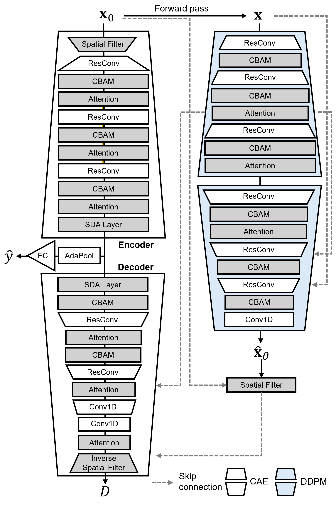

# DiffSA-EEG

A diffusion-based framework for clinical EEG abnormality detection, trained from scratch and
evaluated on the natural class distribution of each corpus.

This repository contains the **model architectures and the training/evaluation core** — the code
that produces every number in the paper's comparison, for any of the nine models, under one shared
protocol.

---

## What is here

```
models/
  SSDA_Modular.py        DiffSA-EEG: ModularDiffE (discriminative net), ConditionalUNet + DDPM
  models_EEGNet.py       EEGNet            (Lawhern et al., 2018)
  models_Deep4Net.py     Deep4Net          (Schirrmeister et al., 2017)
  models_ChronoNet.py    ChronoNet         (Roy et al., 2019)
  models_BDTCN.py        TCN               (Gemein et al., 2020)
  models_EEGConformer.py EEG-Conformer     (Song et al., 2023)
  models_EEGDeformer.py  EEG-Deformer      (Ding et al., 2024)
  models_ATCNet.py       ATCNet            (Altaheri et al., 2023)
train.py                 train one model on one seed and store its predictions
evaluate.py              recompute metrics, operating points and statistics from stored predictions
sample_data/
  make_sample_data.py    generate a synthetic dataset in the same format, to run the code with
                         no data access
docs/architecture.png    the model diagram
```

This is a deliberately compact repository: the architectures, the training loop the results rest
on, and the evaluation that turns predictions into the reported numbers. The preprocessing
specification is documented below so the input format can be built from the public corpora.
Preprocessing and analysis scripts are available from the corresponding author on request.

---

## Quickstart

No data access needed — this runs on synthetic recordings in the same format:

```bash
pip install -r requirements.txt
python sample_data/make_sample_data.py
python train.py --model DiffSA --train_dir sample_data/train --test_npz sample_data/test.npz \
                --seed 42 --epochs 10 --batch_size 4
python evaluate.py --runs runs
```

The synthetic task is deliberately easy and the sample is tiny, so the resulting numbers say
nothing about any model's quality — they only show that the pipeline runs end to end.

---

## Architecture



DiffSA-EEG couples a diffusion branch to a discriminative network. The DDPM U-Net reconstructs the
clean signal in a **single forward pass** — it is used as an auxiliary prior, never as a generator,
and there is no iterative sampling at train or test time.

The discriminative network is built from four components, each independently switchable, which is
what makes the exhaustive 2⁴ = 16-configuration ablation possible:

| flag | component | what it does |
|---|---|---|
| `SF` | spatial filter | learnable layer projecting 21 channels onto 8 components; orthogonally initialized, trained end-to-end (it is *not* CSP and not an SVD of the data) |
| `SDA` | stacked denoising autoencoder | sparse encoder/decoder branch with Gaussian latent noise (σ = 0.05) |
| `ATTN` | self-attention | attention in the encoder bottleneck |
| `CBAM` | convolutional block attention | channel + spatial attention inside the residual blocks |

`DiffSA` is all four on; `Diff-E` is all four off, i.e. the backbone. Together they are two corners
of the same grid, so the component effect is measured under identical seeds and data.

Cost of the full model: **3.32 M parameters, 45.1 GFLOPs, 30.8 ms per recording** on an RTX A6000.
It is the most expensive model in the comparison; no efficiency claim is made.

---

## Training protocol

Identical for every model unless stated. Nothing below is tuned per model.

| | |
|---|---|
| optimizer | AdamW, base LR 1e-5, weight decay 1e-4 |
| schedule | CyclicLR `exp_range`, base 1e-5 → peak 4e-3, one cycle per epoch, γ = 0.9998 |
| epochs | 100 |
| batch size | 32 |
| classifier smoothing | EMA on the classifier head (β = 0.95) |
| class balancing | **none** — trained and evaluated on the natural class distribution |
| repeats | 10 seeds (42–51); every reported value is mean ± SD across seeds |

**Diffusion models, two-stage objective (one step of each per batch):**

1. The DDPM is trained alone. The U-Net predicts the **clean signal X₀** (not the noise ε) and the
   loss is a per-element L1 reconstruction error. Cosine β-schedule (s = 0.008), T = 1000.
2. Its outputs are **detached**, then the discriminative network is trained with
   `SmoothL1(decoder_out, detached DDPM error map) + α · CrossEntropy(logits, y)`, α = 0.1.
   No gradient reaches the diffusion branch from the classification loss.

**One per-model exception:** EEG-Conformer collapses to a constant output at the shared peak LR of
4e-3, so it uses the peak LR from its reference paper (2e-4). That is the published author default,
selected without reference to test performance. Every other model uses 4e-3.

### Epoch selection

`--select best`, the default, scores the model on the test set after each epoch and keeps the
best-scoring epoch. It is applied uniformly to all nine models and all 16 ablation configurations.
The gain from this selection is not identical across architectures, so values obtained with it are
best read as upper bounds.

`--select final` uses the last epoch, with no test-set selection. It is the stricter setting and
the one to prefer for new work built on this code.

---

## Data format

`train.py` reads NPZ files with two keys:

| key | shape | meaning |
|---|---|---|
| `data` | `(N, 120, 21, 250)` float32 | N recordings × 120 windows × 21 channels × 250 samples |
| `labels` | `(N,)` int | 0 = negative class, 1 = positive class |

Preprocessing that produces this layout, applied per recording: resample to **250 Hz**, 1 Hz
Butterworth high-pass, 60 Hz notch, take a 60 s span as two time-reversed segments giving 120
one-second windows, select 21 channels from the standard montage, then z-score.

### Obtaining the corpora

The paper uses TUAB and TUEP from the Temple University Hospital EEG Corpus. They are free but
**credentialed**: a registration form must be signed and returned to the Neural Engineering Data
Consortium, and the agreement does not permit subscribers to redistribute the data. No recording,
raw or preprocessed, is included in this repository for that reason. Request access at
<https://isip.piconepress.com/projects/nedc/html/tuh_eeg/>.

Use `sample_data/make_sample_data.py` to exercise the code while access is pending.

---

## Usage

```bash
pip install -r requirements.txt

# the full model
python train.py --model DiffSA --train_dir data/train --test_npz data/test.npz --seed 42

# the backbone, i.e. all components off
python train.py --model Diff-E --train_dir data/train --test_npz data/test.npz --seed 42

# any single ablation configuration, as SF/SDA/ATTN/CBAM bits
python train.py --model 1010 --train_dir data/train --test_npz data/test.npz --seed 42

# a baseline
python train.py --model Deep4Net --train_dir data/train --test_npz data/test.npz --seed 42

# the stricter protocol: no test-set epoch selection
python train.py --model DiffSA --train_dir ... --test_npz ... --seed 42 --select final
```

Each run writes to `runs/{model}/seed{S}.json` (the seven metrics plus the run configuration) and
`runs/{model}/seed{S}_probs.npz` (the ground truth and the positive-class probability per
recording). **Every reported metric can be recomputed from the saved probabilities without
retraining** — including any operating point other than the default 0.5 threshold.

Reproducing a full table means looping over models and seeds, for example:

```bash
for m in DiffSA Diff-E EEGNet Deep4Net ChronoNet TCN EEGConformer EEGDeformer ATCNet; do
  for s in 42 43 44 45 46 47 48 49 50 51; do
    python train.py --model $m --train_dir data/train --test_npz data/test.npz --seed $s
  done
done
```

and the 16-configuration ablation:

```bash
for c in 0000 0001 0010 0011 0100 0101 0110 0111 1000 1001 1010 1011 1100 1101 1110 1111; do
  for s in 42 43 44 45 46 47 48 49 50 51; do
    python train.py --model $c --train_dir data/train --test_npz data/test.npz --seed $s
  done
done
```

### Evaluation

`evaluate.py` reads the stored probabilities and derives everything the paper reports, so no
retraining is needed to check a number or to ask a different question of the same predictions:

```bash
# the seven metrics per model, mean ± SD over seeds, with the AUC-PR prevalence floor
python evaluate.py --runs runs

# specificity at a fixed clinical sensitivity instead of the arbitrary 0.5 threshold
python evaluate.py --runs runs --sensitivity 0.90

# Mann-Whitney U with Benjamini-Hochberg FDR against one reference model, plus Cohen's d
python evaluate.py --runs runs --compare_to DiffSA
```

A difference that is not significant after FDR correction is a tie and is reported as comparable,
not as a win, even when one mean is nominally higher.

---

## Reported metrics

Accuracy, balanced accuracy, recall (sensitivity), specificity, F1, AUC-PR, and AUROC. Two notes
that matter on an imbalanced corpus:

- **AUC-PR must be read against the prevalence floor**, which is the positive-class fraction of the
  test set and the score a no-skill classifier reaches. AUC-PR values are therefore not comparable
  across corpora with different prevalence.
- **Metrics at the default 0.5 threshold do not order models the way a fixed clinical operating
  point does.** Since `_probs.npz` stores raw probabilities, any operating point — for example the
  specificity attained at a fixed 90 % sensitivity — can be computed afterwards.

---

## Requirements

Python 3.8+, PyTorch with CUDA. See `requirements.txt`. Training one model for 100 epochs on the
epilepsy corpus takes roughly 2 hours on an RTX A6000.

---

## Citation

Paper under review; citation information will be added on acceptance.

## Licence

MIT — see `LICENSE`.

### Third-party code

The baseline architectures are re-implementations or adaptations of published models, and the
original code remains under its own licence. Each file carries the corresponding notice at the top.

| file | source | licence |
|---|---|---|
| `models_EEGNet.py`, `models_Deep4Net.py`, `models_BDTCN.py` | [braindecode](https://github.com/braindecode/braindecode) | BSD-3-Clause |
| `models_EEGConformer.py` | [EEG-Conformer](https://github.com/eeyhsong/EEG-Conformer) | per that repository |
| `models_EEGDeformer.py` | [EEG-Deformer](https://github.com/yi-ding-cs/EEG-Deformer) | per that repository |
| `models_ATCNet.py` | [EEG-ATCNet](https://github.com/Altaheri/EEG-ATCNet) | per that repository |

`models_ChronoNet.py` and `SSDA_Modular.py` are original implementations.

Where a baseline had to be adapted to this study's input shape, the deviation from the reference is
documented in a comment at the top of the file.
